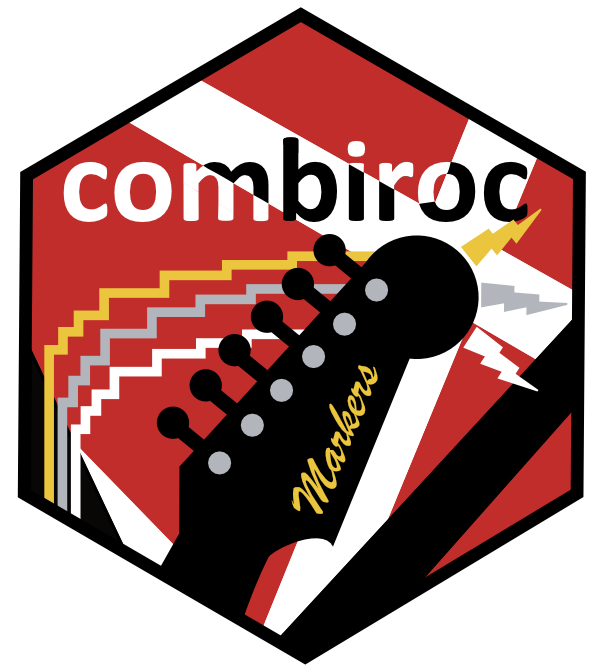

<!-- badges: start -->
[](https://github.com/ingmbioinfo/combiroc/actions)
[](https://lifecycle.r-lib.org/articles/stages.html#experimental-1)
[](https://github.com/ingmbioinfo/combiroc/commits/master)
<!-- badges: end -->

# CombiROC

CombiROC is a totally new music in multi-markers analysis: an R package for efficient and easy combinatorial selection of biomarkers and sensitivity/specificity-driven prioritization of features. 

This is the development version of CombiROC package (combiroc), code in this repo is work in progress and it is uploaded here "as-is" with no warranties implied. Improvements and new features will be added on a regular basis, please check on this github page for new features and releases. 

The CombiROC approach was first published by [Mazzara et al. Scientific Reports 2017](https://www.nature.com/articles/srep45477). A description of the analitycal protocol is also published in [Bombaci & Rossi, Methods Mol Biol 2019](https://link.springer.com/protocol/10.1007%2F978-1-4939-9164-8_16).
The web-app Shiny version of CombiROC is still available at [combiroc.eu](http://combiroc.eu/), but it has limited features (as well as low computational power) and is not further maintained. For full capabilities and customized analyses install this package on your own machine.

Heads up! We're preparing the preprint :page\_facing\_up: on combiroc package and its applications: it will be soon available on bioRxiv. 

## Installation

```r
# First, install devtools from CRAN and run it
install.packages("devtools")
library(devtools)

# Then install the development version of CombiROC from GitHub
install_github("ingmbioinfo/combiroc")
```
## Documentation and tutorials

Main documentation is in the package's vignette. You can also find the web version of the documentation at the [combiroc-project website](https://ingmbioinfo.github.io/combiroc/index.html) created with `pkgdown`.

## Contributors

* Package authors and maintainers: Ivan Ferrari & Riccardo L. Rossi
* Original code of Shiny App: Saveria Mazzara
* Initial idea & conception: Mauro Bombaci

